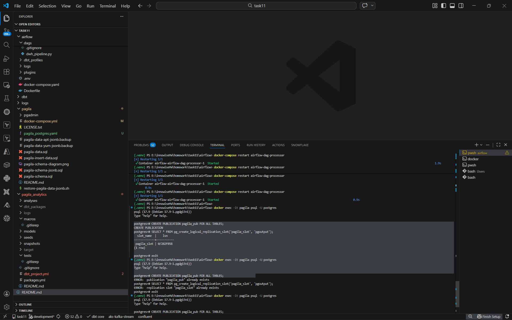
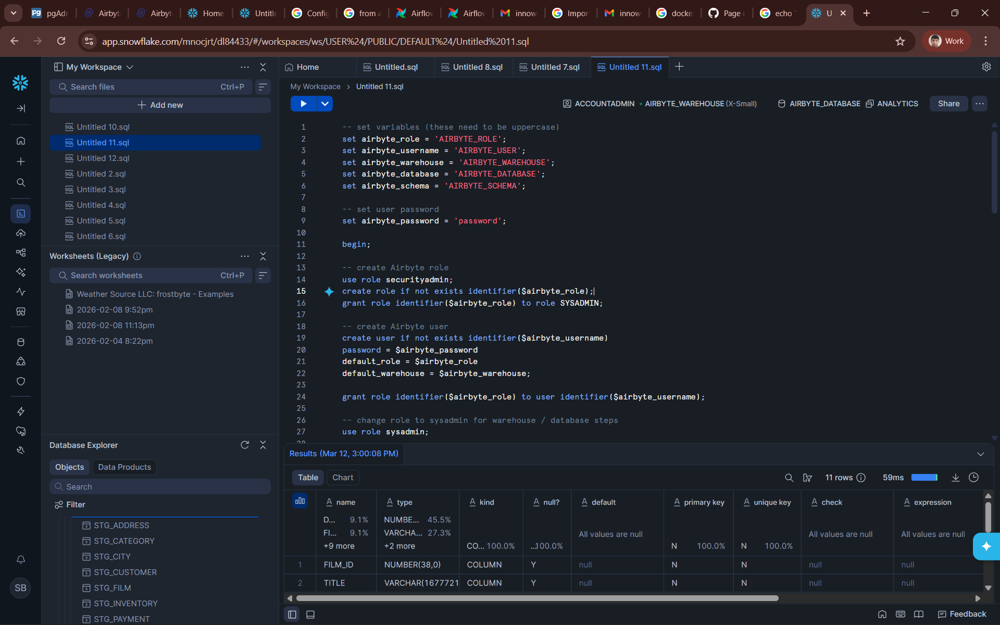
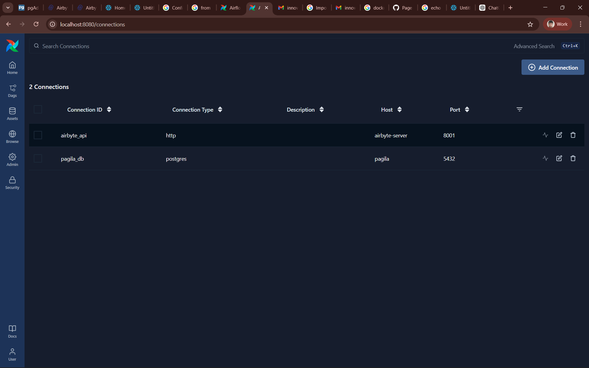
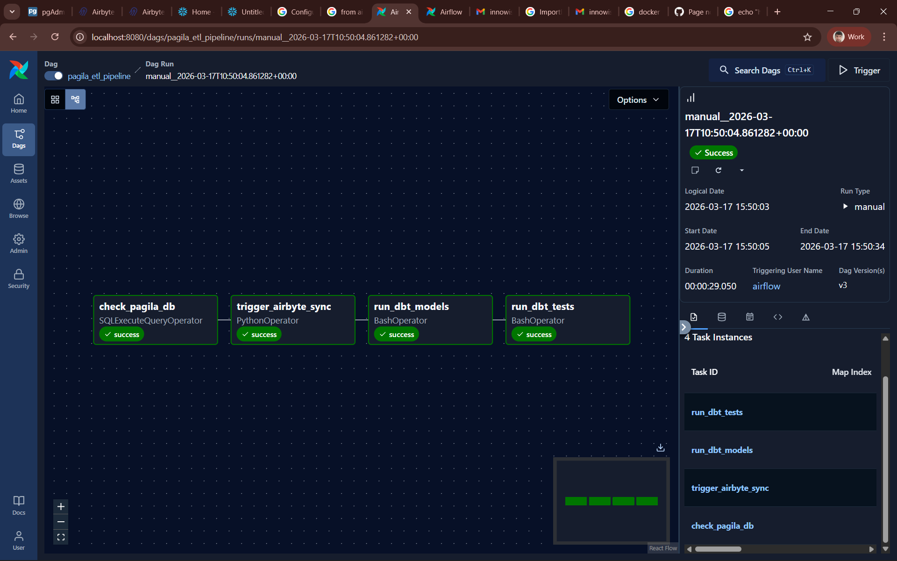
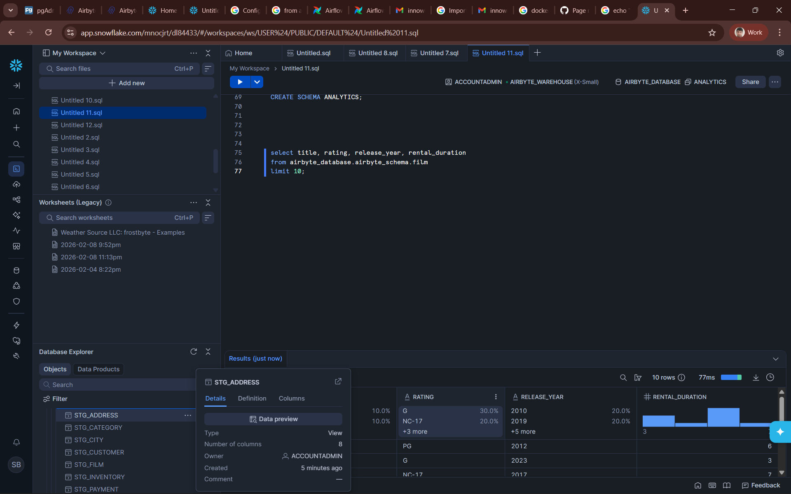
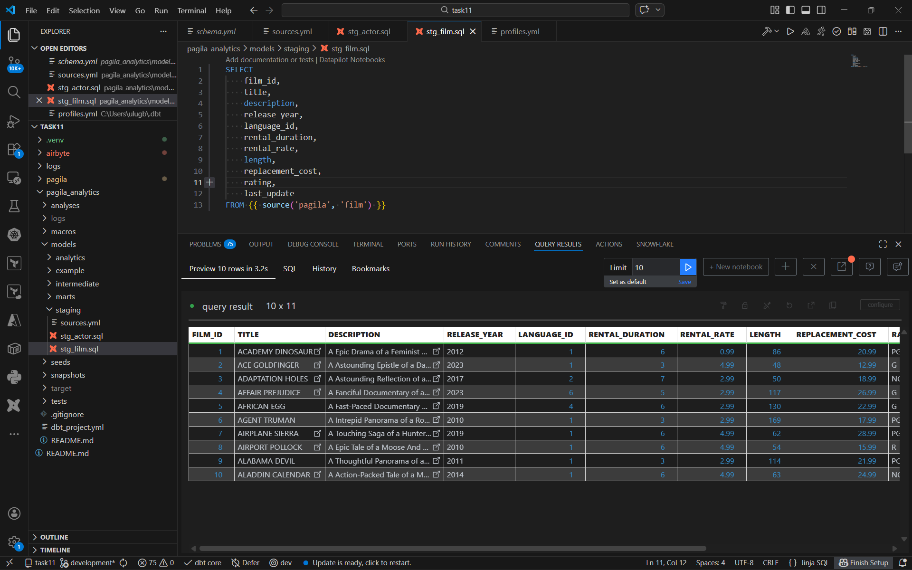
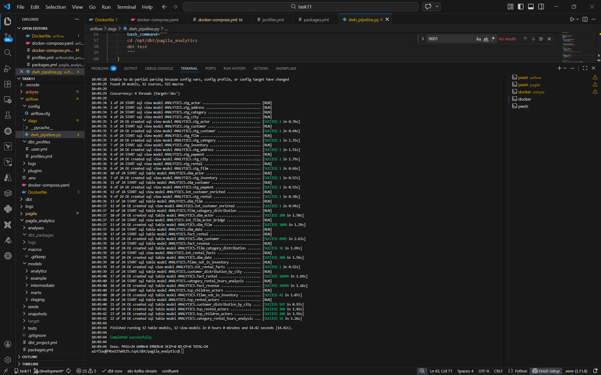

# Task 11 – Pagila Data Pipeline
Development branch initialized

## Data Engineering Project: Pagila ETL to Snowflake with Airflow, Airbyte, and dbt
### Project Overview


This project automates the extraction, transformation, and loading (ETL) of sample databases—Pagila into Snowflake, using Apache Airflow, Airbyte, and dbt for analytics.

The main goals are:

1. Automate database setup and replication.

2. Implement best-practice role-based access controls for Snowflake.

3. Transform raw data into analytics-ready models using dbt.

4. Ensure clarity and alignment of requirements between technical and business teams.


### Technologies Used

* Apache Airflow: Workflow orchestration for ETL pipelines.

* Airbyte: Data replication from source databases to Snowflake.

* Snowflake: Cloud data warehouse for analytics.

* dbt (data build tool): Data transformation and modeling.

* Pagila & Sakila databases: Sample datasets representing a movie rental business.


### Project Steps
For this project, we are using Airbyte v0.63.12 because it provides a Docker Compose setup which simplifies local deployment and integration with Airflow and Snowflake.
1. Clone the Airbyte repository:
```bash
git clone --depth 1 --branch v0.63.12 https://github.com/airbytehq/airbyte.git
```
2. Configure Git to allow long paths (required on Windows):
```bash
git config --system core.longpaths true
```
3. Start Airbyte using Docker Compose:
```bash
./run-ab-platform.sh
```


### Docker Compose Networking

To allow Pagila, Airflow, and Airbyte containers to communicate with each other, we created a shared Docker network.
```bash
docker network create data-pipeline-network
```

And made sure this is is included in Docker compose files
```
networks:
  data-pipeline-network:
    external: true
```


### Pagila data setup
```bash
git clone https://github.com/devrimgunduz/pagila.git
```

```bash
docker compose up -d
```

### Airbyte Replication Modes
Replication Slot (For Incremental / CDC) 

Airbyte creates a replication slot in PostgreSQL to track changes.

Recommended to name the slot something like: *pagila_slot*

```sql
CREATE PUBLICATION airbyte_pub FOR ALL TABLES;
```



### Snowflake Role Configuration

To follow security best practices:

A development role was created in Snowflake for Airbyte

The admin role was not used by Airbyte, ensuring principle of least privilege.

Airflow connections were updated to use this development role.

Replication to Snowflake was tested successfully with the new role.




### dbt Setup and Project Configuration

Implement dbt for transforming raw data into analytics-ready models:

Install dbt with Snowflake adapter: dbt-snowflake.

Initializ a dbt project called pagila_analytics.

Configur Snowflake connection in profiles.yml.

Test the connection with dbt debug.

### Airflow
We have to make sure we include connections via admin in airflow







